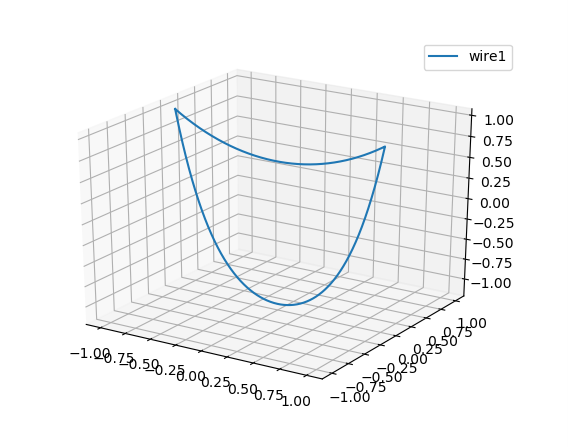

# Catenary (Saggy) Lines Formation

By Gus Cheng Zhang, The University of Manchester, UK. 2024.

## General Equation
A catenary line is defined by the equation:
$$
z = a \cosh\left(\frac{r - r_0}{a} + z_0\right)
$$
where $a$ is the sagging parameter, $r_0$ is the horizontal offset, and $z_0$ is the vertical offset. The catenary line describes the shape of a hanging cable or chain under its own weight.

### Describing the curve when knowning $a$
Knowing two mounting points $\langle x_1, y_1, z_1 \rangle$ and $\langle x_2, y_2, z_2 \rangle$ and the sagging parameter $a$, the constants $r_0$ and $z_0$ can be solved using Newton's method.

### Describing the curve when $a$ is unknown, but the length is known
It is the natural way of describing a catenary line when the length of the wire is known. The arc length of a catenary line is given by:
$$
l = \int{\sqrt{1+\left(\sinh^2\frac{r - r_0}{a}\right)} \mathrm{d}r}=a\sinh\frac{r-r_0}{a}
$$
Define the solution vector as
$$
v=\begin{pmatrix}
r_0 \\
a
\end{pmatrix}
$$
Newton function of $f:N=N_f:\mathbb{R}^2\to\mathbb{R}^2$ is defined as:
$$
N(v)=v-J_v^{-1}(f(v))
$$
where $J_v$ is the Jacobian matrix of $f$ at $v$. 
$$
J_v=\begin{pmatrix}
f_{r_0}^1 & f_{a}^1 \\
f_{r_0}^2 & f_{a}^2
\end{pmatrix}\bigg\vert_{v}
$$
where
$$
f_{r_0}^1 = -\sinh\frac{\Delta r-r_0}{a} - \sinh\frac{r_0}{a}
$$
$$
f_{a}^1 = \frac{a\left(\cosh\frac{\Delta r-r_0}{a} - \cosh\frac{r_0}{a}\right)-(\Delta r-r_0)\sinh\frac{\Delta r-r_0}{a}+r_0\sinh\frac{r_0}{a}}{a}
$$
$$
f_{r_0}^2 = -\cosh\frac{\Delta r-r_0}{a} + \cosh\frac{r_0}{a}
$$
$$
f_{a}^1 = \frac{a\left(\sinh\frac{\Delta r-r_0}{a} + \sinh\frac{r_0}{a}\right)-(\Delta r-r_0)\cosh\frac{\Delta r-r_0}{a}-r_0\cosh\frac{r_0}{a}}{a}
$$

## Example
Input file: key_points.in
```
1
0.0005 1
c 3
-1 0 1 0 				First point has no segment length 
1 0 1 2.2
-1 0 1 5
```

Result:
```
1.0584e-05				Self-inductance = 10.584 uH
7.2					    Total length = 2.2 + 5 = 7.2
```


